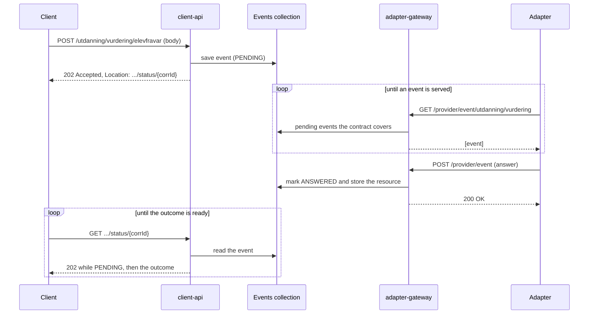
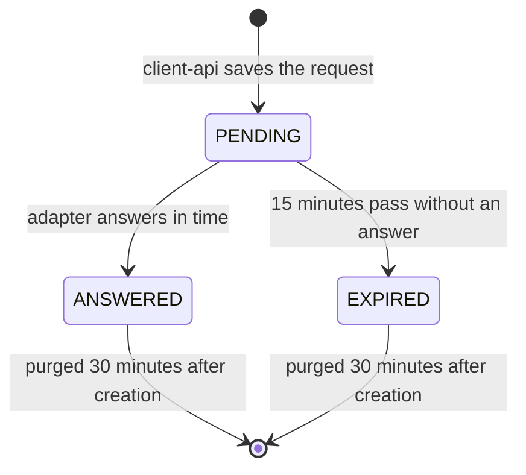

# Events

An event is a question from a client that an adapter answers. The client asks the client-api, the adapter picks the
question up from the adapter-gateway, answers it, and the client asks the client-api for the outcome.

Writes (create, update, delete, validate) have always been events. A live read is an event too,
see [live-read.md](live-read.md).

## Who is involved

| Part              | Role                                                                                                                                         |
|-------------------|----------------------------------------------------------------------------------------------------------------------------------------------|
| Client            | A county system. Sends the request and polls for the outcome.                                                                                |
| client-api        | Client-facing service. Stores the event and serves the outcome.                                                                              |
| Events collection | One Mongo collection per org, named `<org>_events`. Both services read and write it.                                                         |
| adapter-gateway   | Adapter-facing service. Serves pending events to adapters and takes their answers.                                                           |
| Adapter           | The source system's connector. Polls for events it has a contract for and answers them.                                                      |
| Kafka             | A feed only. Write requests and answers are copied there for other systems, such as the status service. Nothing in the flow waits for Kafka. |

## A write, step by step

The gateway stores the resource and marks the event answered in one Mongo transaction. A validate never stores anything,
and neither does a create that failed.

## The life of an event

| Timing                                          | Value            | Where it is set                                                             |
|-------------------------------------------------|------------------|-----------------------------------------------------------------------------|
| Time an adapter has to answer                   | 15 minutes       | `fint.consumer.event.answer-deadline` (client-api)                          |
| Time the event document lives in Mongo          | 30 minutes       | `fint.consumer.event.retention` (client-api), enforced by a Mongo TTL index |
| How often overdue events are flipped to EXPIRED | every 30 seconds | `fint.provider.event.expiry-sweep-interval` (adapter-gateway)               |

An adapter is only served events that are still PENDING and inside their deadline. Once an event has been answered or
has expired, a late answer is refused.

## What the client sees on the status endpoint

`GET /{domain}/{package}/{resource}/status/{corrId}`

| Situation                                        | Answer                                                        |
|--------------------------------------------------|---------------------------------------------------------------|
| Still waiting for the adapter                    | 202 Accepted                                                  |
| Create or update answered                        | 201 Created, `Location` of the resource, the resource as body |
| Validate answered                                | 200 OK with the adapter's answer                              |
| Delete answered                                  | 204 No Content                                                |
| Adapter rejected the request                     | 400 Bad Request                                               |
| Adapter reported a conflict                      | 409 Conflict                                                  |
| Adapter reported a failure, or the event expired | 500 Internal Server Error                                     |
| Unknown `corrId`, or the event was purged        | 410 Gone                                                      |

## What an adapter may be served

An adapter registers a contract with `POST /provider/register`. The contract decides which events it is served:

- It must hold the role for the package (for example `FINT_Adapter_utdanning_vurdering`).
- It must have a contract for the org.
- The contract's `eventCapabilities` must cover the resource and the operation. A resource that is not listed there gets
  every operation except READ, which is how adapters that know nothing about live reads keep working.

An answer is checked the same way against the stored request, so an adapter cannot answer an event it would not have
been served.
