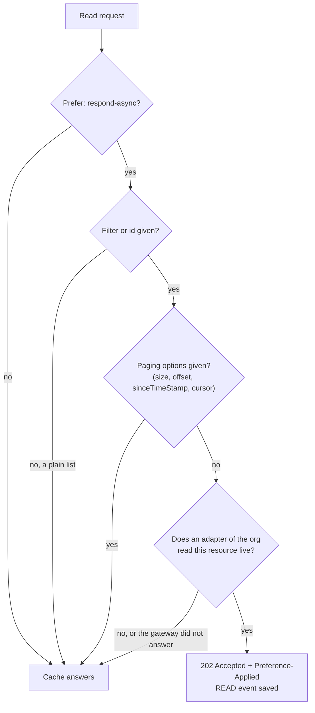
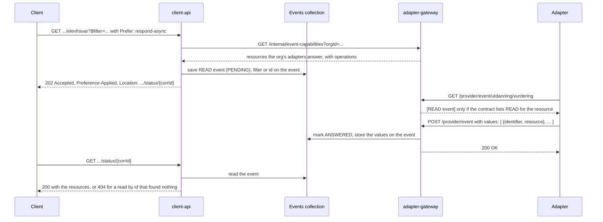

# Live reads

By default a client reads from the cache, which the adapters fill through syncs. A live read asks the source system
instead, right now, through the adapter. It is an event with the operation `READ`, and it follows the same path as a
write: see [events.md](events.md).

The cache always answers. A live read is something a client asks for, and only happens when every condition below holds.
Otherwise the cache answers as if nothing was asked.

## How a client asks

Add the header `Prefer: respond-async` to a read that names what it wants:

| Read                  | Example                                                                              |
|-----------------------|--------------------------------------------------------------------------------------|
| By filter             | `GET /utdanning/vurdering/elevfravar?$filter=systemId/identifikatorverdi eq '12345'` |
| By filter in the body | `POST /utdanning/vurdering/elevfravar/$query`                                        |
| By id                 | `GET /utdanning/vurdering/elevfravar/systemid/12345`                                 |

When the read goes live the client gets `202 Accepted`, a `Location` to poll, and the header
`Preference-Applied: respond-async`. When the cache answers instead, the response is a normal
`200` without `Preference-Applied`. That header is how a client can tell the two apart.

## When does a read go live?



The last question is answered by the adapter-gateway, which owns the contracts. client-api calls
`GET /internal/event-capabilities?orgId=...` on the gateway in the same namespace. The path is reachable inside the
cluster only. When the gateway cannot be reached, the cache answers, which is the designed fallback and not an error.

## Which adapters read live

An adapter says so in its contract, per resource:

```json
{
  "eventCapabilities": [
    {
      "domainName": "utdanning",
      "packageName": "vurdering",
      "resourceName": "elevfravar",
      "operations": [
        "READ"
      ]
    }
  ]
}
```

A listed resource gets exactly the listed operations, so an adapter that lists only `READ` for a resource is not served
writes for it. A resource that is not listed keeps today's behaviour:
every operation except `READ`.

## A live read, step by step



Nothing from a live read is written to the cache. The result lives on the event document and is purged with it after 30
minutes. It is also never put on Kafka: live reads are not on the feed.

## What the adapter sends back

| Rule                                              | Why                                                                                                                                                             |
|---------------------------------------------------|-----------------------------------------------------------------------------------------------------------------------------------------------------------------|
| `values` holds the resources, `value` stays empty | A read can return many resources, a write returns one.                                                                                                          |
| A read by id returns at most one value            | The client asked for one resource.                                                                                                                              |
| An empty `values` list is a valid answer          | "Nothing matched" is a result, not an error.                                                                                                                    |
| A failed or rejected answer carries no values     | The error message is the answer.                                                                                                                                |
| A conflicted answer is not allowed                | Conflicts belong to writes.                                                                                                                                     |
| The answer may be at most 8 MB                    | The result is stored on one Mongo document. A larger answer gets `413` and the event closes as rejected with "use a narrower filter", so the client sees `400`. |

Every resource in `values` is bound to the FINT model on the way in, so a resource that does not fit the model is
refused with `400` to the adapter instead of reaching a client.

## What the client sees on the status endpoint

| Situation                                              | Answer                                                                        |
|--------------------------------------------------------|-------------------------------------------------------------------------------|
| Still waiting for the adapter                          | 202 Accepted                                                                  |
| Read by filter answered                                | 200 OK with a list, the same shape as a cache read. An empty list is 200 too. |
| Read by id answered with a resource                    | 200 OK with the resource                                                      |
| Read by id answered with nothing                       | 404 Not Found                                                                 |
| Adapter rejected the read, or the answer was too large | 400 Bad Request                                                               |
| Adapter reported a failure, or the event expired       | 500 Internal Server Error                                                     |
| Unknown `corrId`, or the event was purged              | 410 Gone                                                                      |

Back-links from autorelation are added to the resources before they are served, read from the relation edges the cache
already holds. No edges are written for a live result.

## Where to look in the code
