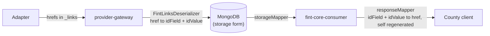
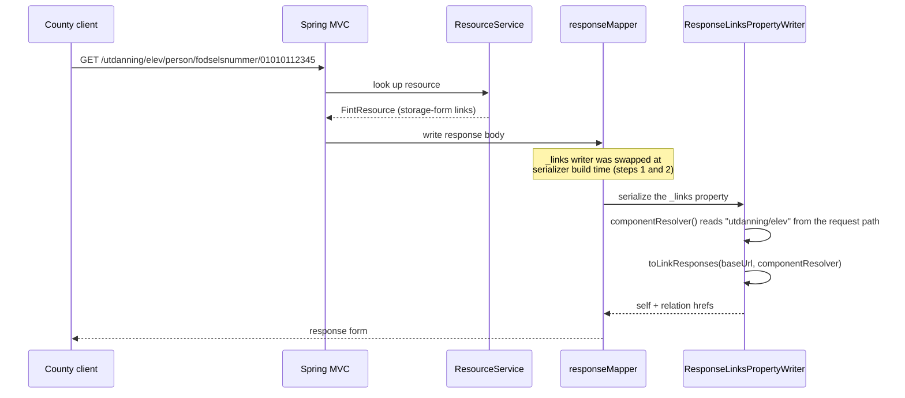

# fint-core-shared

Shared library used by both deployable services. What lives here:

| Package | Role |
|---|---|
| `json` | The two Jackson contracts and all `_links` handling. This README's main topic. |
| `store` | The MongoDB resource store both services read/write through. |
| `kafka` | Header codecs and sync metadata for the Kafka topics. |
| `uri` | `LinkCodec`, the only place a link id value is percent-encoded or decoded. |
| `model` | Small shared value types (`OrgId`, `ResourceCoordinate`). |

---

## The JSON layer: where `_links` is handled

### One resource, two JSON forms

Every FINT resource exists in exactly two JSON shapes, and `FintJson` is the only
place either mapper is assembled. Never build one by hand.

**Storage form**: what MongoDB documents and the provider's buffer topic hold.
Links are id-based, `self` does not exist:

```json
{
  "fodselsnummer": { "identifikatorverdi": "01010112345" },
  "_links": {
    "foreldreansvar": [ { "idField": "fodselsnummer", "idValue": "02020254321" } ]
  }
}
```

**Response form**: what a county client receives. Same resource, every link
entry rendered as a `LinkResponse` (an absolute `href`) and `self` regenerated
from the id fields:

```json
{
  "fodselsnummer": { "identifikatorverdi": "01010112345" },
  "_links": {
    "self": [ { "href": "https://beta.felleskomponent.no/utdanning/elev/person/fodselsnummer/01010112345" } ],
    "foreldreansvar": [ { "href": "https://beta.felleskomponent.no/utdanning/elev/person/fodselsnummer/02020254321" } ]
  }
}
```

| Mapper | Produces | Used by |
|---|---|---|
| `FintJson.storageMapper()` | storage form | everything that reads/writes Mongo or Kafka, in both services |
| `FintJson.responseMapper(baseUrl, componentResolver)` | response form | the consumer's primary HTTP `ObjectMapper`, nothing else |

### The journey of a link



Hrefs are converted to the id form **once, at ingest**, and converted back
**per request, at response time**. They cannot be stored as hrefs: the same
Person renders different hrefs depending on which component the request came
through and which environment's baseUrl is in play.

### Inbound: `FintLinksDeserializer`

The single reader for every `_links` field that enters the platform, attached to
`FintResource.links` by the mixin in `FintModelModule`. It accepts three entry
shapes (bare href string from adapters, the old platform's `{"href": …}` object,
and our own storage form) and lands them all as the same id-based `Link`.

It is a `ContextualDeserializer` because an href can only be resolved against
the id fields of the resource it points *to*, and which resource that is depends
on which relation of the *owning* resource the entry sits under. An href that
cannot be resolved is kept verbatim as `Link.unresolved`, never discarded, and
travels through storage untouched until the response layer emits it as-is.

The full contract is in the class KDoc.

### Outbound: the serialization steps

All outbound machinery lives in `ResponseLinks.kt`. The chain has three Jackson
steps (each carries a `Step N` KDoc) and hands off to plain Kotlin as fast as
possible:

1. **`ResponseLinksModule`**: registered once, in `FintJson.responseMapper`.
   Installing it is the single act that turns a mapper into the response-form mapper.
2. **`ResponseLinksSerializerModifier`**: Jackson calls it once per bean *type*
   when that type's serializer is first built. For every `FintResource` subtype it
   swaps the `_links` property writer; every other type passes through untouched.
3. **`ResponseLinksPropertyWriter`**: runs on every serialization of a resource,
   top-level or nested, and writes the rendered links instead of the stored map.
4. **`toLinkResponses`**: where the actual logic lives. A plain function on
   `FintResource`, no Jackson imports, unit-tested directly in `ResponseLinksTest`.
   Regenerates `self` from the id fields, renders each stored relation via
   `metadata.relationPath` + `LinkCodec.encodeIdValue`.



Why a serializer modifier and not DTO mapping in the controllers: the rule is
identical for ~160 generated resource types, must also hit resources nested
inside other resources, and forgetting it at one call site would silently leak
storage-form links into responses. On the mapper it is impossible to bypass;
`ResponseLinksTest` and `CommonResourceLinksIT` pin the behavior.

### Common resources and `ComponentResolver`

Person, Kontaktperson and Virksomhet exist as one class each and have no path of
their own (`metadata.path == null`). They are served under *every* component
that references them (`utdanning/elev/person`, `administrasjon/personal/person`,
and so on), so their hrefs can only be rendered against the component the
request came through. `ComponentResolver` supplies exactly that: the consumer's
`JacksonConfiguration` reads `domainName`/`packageName` from the request being
served. Outside a request the resolver yields `null` and such links are simply
omitted.

### File map

| File | Role |
|---|---|
| `json/FintJson.kt` | The two mapper recipes, the only place mappers are assembled. |
| `json/FintModelModule.kt` | Mixins attaching the Jackson annotations the (Jackson-free) model jar cannot carry. |
| `json/FintLinksDeserializer.kt` | Inbound: every `_links` shape becomes an id-based `Link`. |
| `json/ResponseLinks.kt` | Outbound: id-based `Link` becomes hrefs plus a regenerated `self`. |
| `json/LinkResponse.kt` | The response-form link value: `{"href": …}`. |
| `uri/LinkCodec.kt` | Percent-codec for id values; encode on the way out, decode at ingest. |
